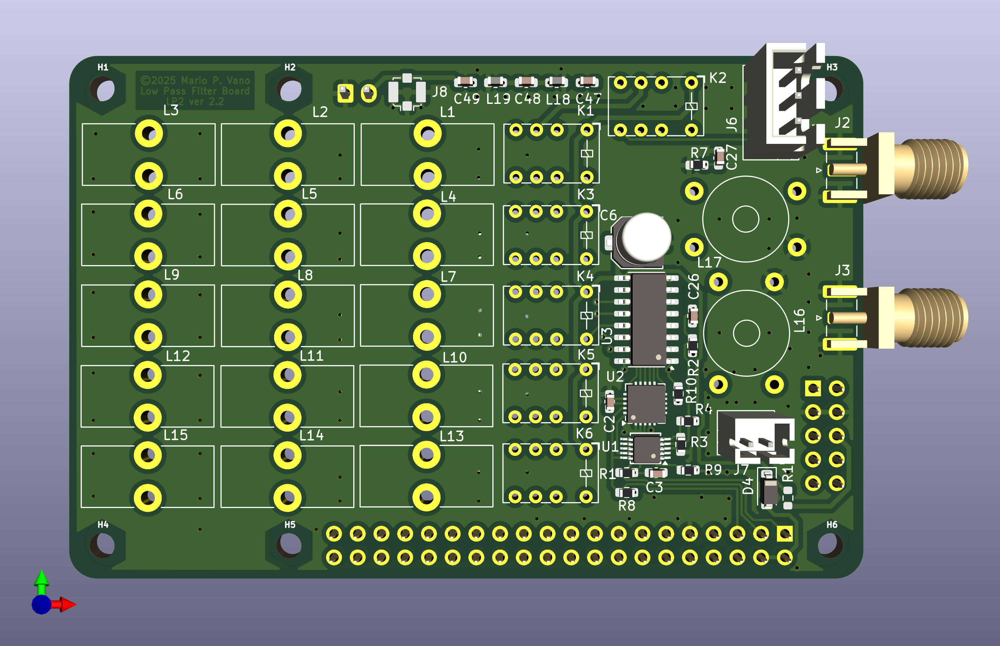

## The LPF2 Filter Board

LPF2 is a combined Relay Switched Harmonic Filter, Receiver High Pass Filter, VSWR bridge and Antenna Relay board for Low Powered HF Radios. It is designed primarily for use with radio board sets that stack mechanically with the Raspberry Pi. and has been successfully used to build several different radios.

The LPF2 board is compatible for stacking with boards designed to the Raspberry Pi "Hat" specification, although it is not a "hat" as it is the same size as the Pi itself and overhangs the IO connectors. It can also be used as a standalone board with anything that can provide compatible I2C and TX/RX control signals, and 3.3 Volt and Relay Power.

It can be built to use 4.5 Volt relays powered from the GPIO connector or for 12 Volt relays powered from an external source.

## N2ADR Filter Compatibility

The board was designed for limited software compatibility with the popular N2ADR filter board used by the Hermes Lite 2 radio and widely supported in SDR software. The board is NOT completely compatible with N2ADR's design. It differs in the following ways:

  1. The receiver low pass filter is always active - the control bit is IGNORED
  2. There are only 5 Low Pass filters. The control bit for "160 meters" is IGNORED.
  3. The Most significant bit of the control word is wire or'ed with the external Transmit/Receive line allowing software T/R switching.
  4. The VSWR bridge uses a different ADC, so that it does not conflict with any HL2 compatible hardware in the radio - but this means it is not directly displayable by SDR software expecting the HL2 VSWR ADC.

The board has been used primarily with "Radioberry" and "RadioHat" Boards to build 5-10 watt 3-30Mhz Multimode Ham Transceivers.

## Filter Component Selection

The Low Pass Filters are not suitable for extremely dirty power amplifiers. They are designed to reduce the harmonic emissions from properly designed amplifiers within legal limits by reducing the harmonics - not totally eliminating them. As such, they may not work with single ended power amplifiers without modification to the filter values - The design expects the 2nd harmonic to be somewhat reduced by the power amplifier.

The filter component values are based on the popular ones originally published by the RSGB.

The VSWR bridge transformers are conservatively designed so that the diodes are protected in the event of higher power being applied. To improve the sensitivity, reduce the ratio to 10:1 or 7:1 and adjust the software used for power calculation accordingly.

Variations in filter material batches may requre trimming the Toroid coil values by 1 or two turns or spreading or compacting them.

## Hints

I suggest testing the board's logic functionality while assembling it before the relays and filter components are installed since rework is difficult once the relays are in place.

I've also provided the source for a simple TK python program I use to view the VSWR, power and battery voltage in a separate window on my radios.

## Disclaimers

I designed this board for my own use. I have no plans to provide PCBs or boards to others at this time. Hopefully, if there is interest in this board others will provide for group builds, completed boards, or group purchases.

Anyone may use this design for any purpose whatsoever, although I would prefer that it retain some credit to me as the original designer. I will not provide support for any boards using this design that have not been actually built by ME!

If you build any boards or devices using this design, you are totally responsible for any associated liabilities.

This design was only possible thanks to the excellent work done by George Dobbs G3RJV, James Ahlstrom N2ADR, and everyone associated with the HL2 and Radioberry projects.

Mario Vano
AE0GL
